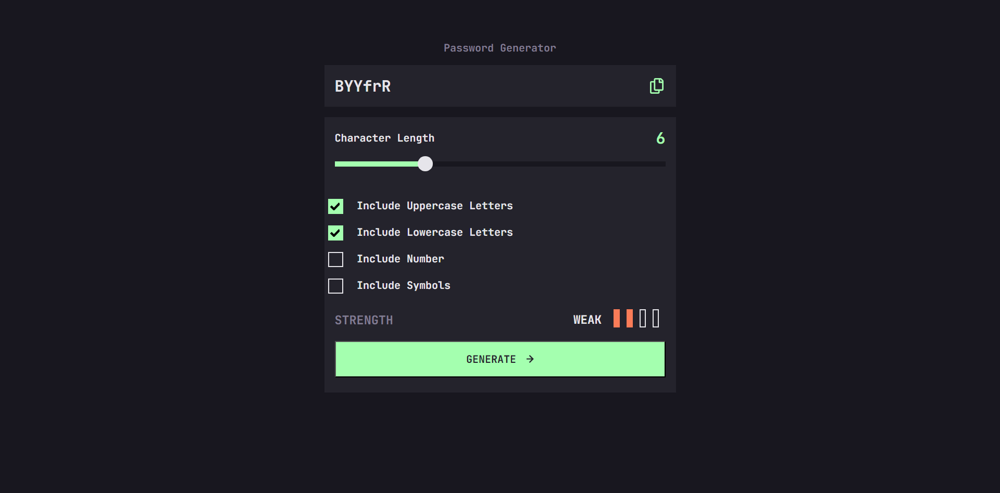

# Frontend Mentor - Password generator app solution

This is a solution to the [Password generator app challenge on Frontend Mentor](https://www.frontendmentor.io/challenges/password-generator-app-Mr8CLycqjh). Frontend Mentor challenges help you improve your coding skills by building realistic projects.

## Table of contents

- [Overview](#overview)
  - [The challenge](#the-challenge)
  - [Screenshot](#screenshot)
  - [Links](#links)
- [My process](#my-process)
  - [Built with](#built-with)
  - [What I learned](#what-i-learned)
  - [Useful resources](#useful-resources)
- [Author](#author)

## Overview

### The challenge

Users should be able to:

- Generate a password based on the selected inclusion options
- Copy the generated password to the computer's clipboard
- See a strength rating for their generated password
- View the optimal layout for the interface depending on their device's screen size
- See hover and focus states for all interactive elements on the page

### Screenshot

### Links

- Solution URL: (https://github.com/travisdk/password-generator)
- Live Site URL: (https://travisdk.github.io/password-generator/)

## My process

My tools will be React/Typescript with the Vite bundler.
Normal CSS , no framework.

I need to find out how to rate the strength of passwords.
Decided to go with this: https://github.com/deanilvincent/check-password-strength
The returned categories for strength lines up with the required: "Too Weak", "Weak", "Medium" and "Strong".
All 4 main symbol categories (diversety=4) needs to be present before "Strong" is outputted.
So if for instance 15 characters are selected but the generated output has a diversity of only "3" the result will be "Medium" (Not "Strong").
Can be discussed if this should work in another way but I decided to go with this solution.
An alternative project to use as inspiration could be this:
https://www.npmjs.com/package/zxcvbn

### Built with

- CSS custom properties
- Flexbox
- Mobile-first workflow
- [React](https://reactjs.org/) - JS library
- Typescript

### What I learned

How to copy text to clipboard using window.navigator
How to customize input range slider across current browsers

### Useful resources

https://www.w3schools.com/howto/howto_js_copy_clipboard.asp
https://shiksha-com.medium.com/input-range-slider-e771132468b1

## Author

- Website - [Henrik Juhl](https://www.hekkecoding.com)
- Frontend Mentor - [@travisdk](https://www.frontendmentor.io/profile/travisdk)
